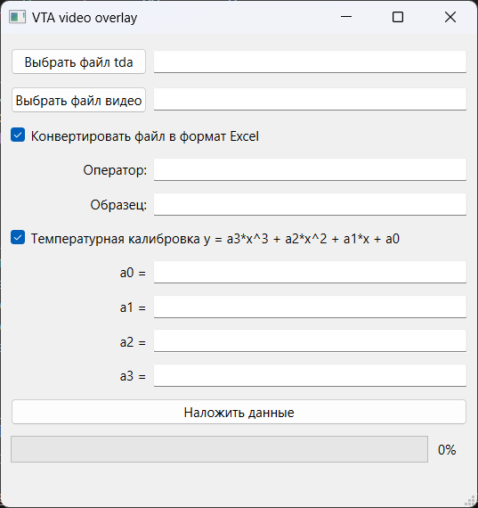

# VTA Video Overlay Tool


Desktop application for overlaying VPTAnalyzer (VTA) sensor data onto video recordings. Supports EMF, temperature, and metadata visualization with configurable overlay elements.

## Features

- **Data Overlay**: Displays time, EMF (mV), temperature (°C), operator, and sample info
- **File Processing**:
  - Import `.tda` sensor data files
  - Process ASF/MP4 video files
  - Export to MP4 with H.264/HEVC/MPEG-4 codecs
- **Video Cropping**: Interactive crop selection with real-time preview
- **Excel Export**: Convert TDA files to formatted Excel reports with charts
- **Multi-language Support**: Automatic Russian/English localization
- **Customizable Overlay**:
  - Configurable logo placement
  - Additional text field support

## Requirements

- Python 3.11+ (recommended 3.12)
- [FFmpeg & FFprobe](https://ffmpeg.org/download.html) in system PATH
- [Poetry](https://python-poetry.org/docs/) for dependency management

## Installation

```bash
git clone https://gitflic.ru/project/i-o-yurev/vta-video-overlay.git
cd vta-video-overlay
poetry install
```

## Build from Source

**Windows:**
```cmd
build.cmd
```

**Linux:**
```bash
bash build.sh
```

Build artifacts will be placed in `pyinstaller/dist`.

## Usage

### First-Time Setup
Generate UI files and translations:
```cmd
uic.cmd  # Windows
bash uic.sh  # Linux
```

### Running the Application
```bash
poetry run python -m vta_video_overlay
```

### Workflow
1. **Load Files**:
   - Select `.tda` sensor data file
   - Choose input video file (ASF/MP4)

2. **Configure Overlay**:
   - Enter operator/sample information
   - Adjust temperature calibration coefficients
   - Enable/disable Excel export

3. **Optional Cropping**:
   - Use crop tool to select video region
   - Adjust via numeric inputs or interactive GUI

4. **Process Video**:
   - Set output path
   - Monitor progress in status bar
   - View processed video preview



## Configuration

Create/edit `config.ini` in the application data folder:

```ini
[Overlay]
additional_text = "Custom Text"
additional_text_enabled = True
logo_enabled = True
```

### Configuration Paths
- **Windows**: `%APPDATA%\vta_video_overlay`
- **Linux**: `~/.local/share/vta_video_overlay`

Place `logo.png` in main executable folder for custom branding.

## License

MIT License. See [LICENSE](LICENSE) for details.