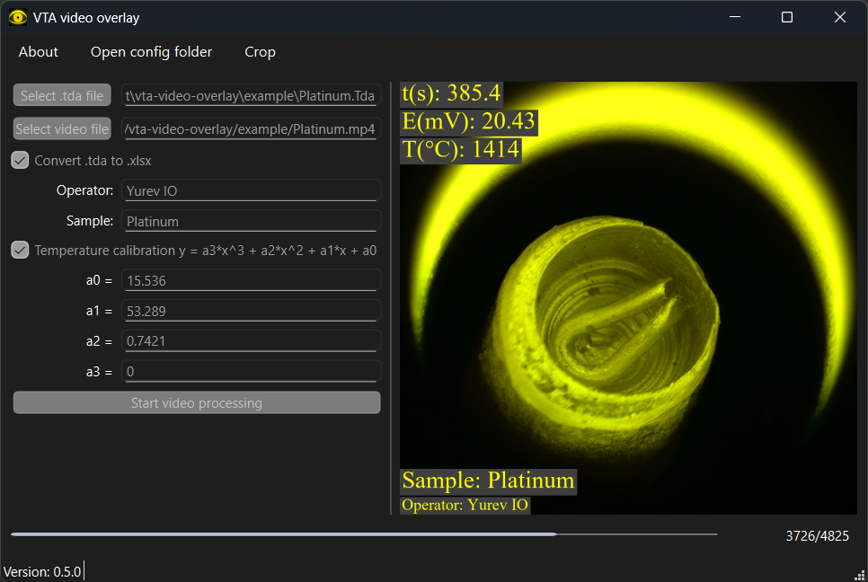

[](https://doi.org/10.5281/zenodo.15213766)
# VTA Video Overlay Tool


Десктопное приложение для наложения данных VPTAnalyzer (VTA) на видеозаписи. Поддерживает визуализацию данных ЭДС, температуры и метаданных с настраиваемыми элементами наложения.

## Возможности

- **Наложение данных**:
  - Отображение времени, ЭДС (мВ), температуры (°C), оператора и информации об образце
  - Калибровка температуры через полиномиальные коэффициенты
  - Настраиваемые размеры основного и дополнительного текста

- **Обработка файлов**:
  - Импорт файлов с данными `.tda`
  - Обработка видеофайлов ASF/MP4
  - Экспорт в MP4 с кодеками H.264/HEVC/MPEG-4
  - Пакетная конвертация `.tda` в форматированные Excel-отчёты с графиками

- **Инструменты**:
  - Интерактивный выбор области обрезки с предпросмотром
  - Поддержка двух языков (английский/русский) с автоопределением системной локали
  - Логирование операций и обработка ошибок

## Требования

- Python 3.11+ (рекомендуется 3.12)
- [FFmpeg & FFprobe](https://ffmpeg.org/download.html) в системном PATH
- [uv](https://docs.astral.sh/uv/) для управления зависимостями

## Установка

```bash
git clone https://gitflic.ru/project/i-o-yurev/vta-video-overlay.git
cd vta-video-overlay
uv sync
```

Создаётся виртуальное окружение в `.venv` со всеми установленными зависимостями.

## Сборка из исходников

**Windows:**
```cmd
build.cmd
```

**Linux:**
```bash
bash build.sh
```

Собранные файлы будут размещены в `pyinstaller/dist`.

## Использование

### Первоначальная настройка
Сгенерируйте файлы интерфейса и переводов:
```cmd
uic.cmd  # Windows
bash uic.sh  # Linux
```

### Запуск приложения
```bash
uv run python -m vta_video_overlay
```

### Процесс работы
1. **Выбор файлов**:
   - Выберите файл с данными `.tda`
   - Укажите входной видеофайл (ASF/MP4)

2. **Настройка**:
   - Введите информацию об операторе/образце
   - Настройте коэффициенты температурной калибровки
   - Включите/выключите экспорт в Excel

3. **Обрезка видео** (опционально):
   - Используйте инструмент обрезки для выбора области
   - Настройте параметры через числовые поля или графический интерфейс

4. **Обработка**:
   - Укажите путь для сохранения
   - Следите за прогрессом в статусной строке
   - Просмотрите результат обработки



## Конфигурация

Создайте/отредактируйте файл `config.ini` в папке данных приложения:
```ini
[Overlay]
additional_text = "Произвольный текст"
additional_text_enabled = True
logo_enabled = True
main_text_size = 60
additional_text_size = 40
language = ru
```

### Пути конфигурации
- **Windows**: `%APPDATA%\vta_video_overlay`
- **Linux**: `~/.local/share/vta_video_overlay`

Для использования собственного логотипа разместите файл `logo.png` в папке с исполняемым файлом.

## Лицензия

MIT License. Подробности см. в файле [LICENSE_RU](LICENSE_RU).

---

[История изменений](CHANGELOG.md) | [Сообщить об ошибке](https://gitflic.ru/project/i-o-yurev/vta-video-overlay/issue) | [English version](README.md)
